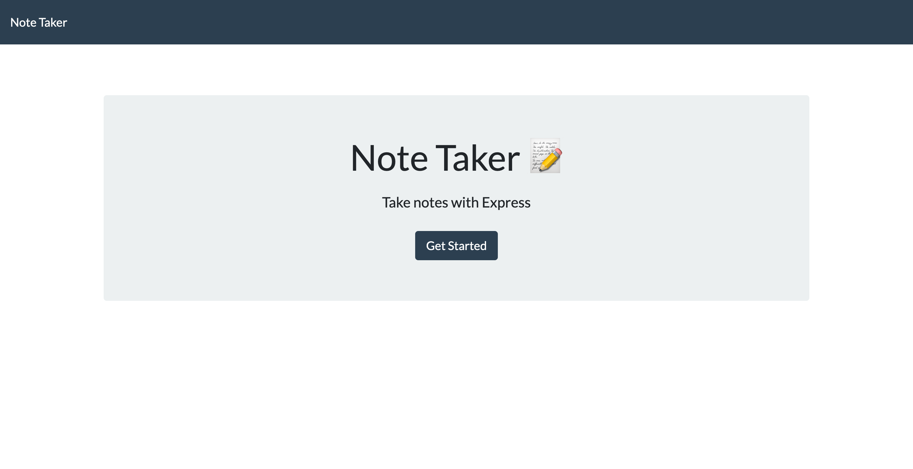

# Note Taker

## Description
Note Taker is an online Node.js application that allows a user to take notes in a clean and organized way to improve task management and productivity.

## Table of Contents
- [Installation](#Installation)
- [Usage](#Usage)
- [License](#License)
- [Credits](#Credits)

## Installation
Note Taker can be accessed by visiting https://sleepy-thicket-90092.herokuapp.com/ or can be installed for personal modifications by forking or cloning from https://github.com/valiantcreative33/note-taker.

## Usage
Note Taker is a lightweight, simple online note taking application that allows a user to quickly compile notes for task management and other organizational needs. Users are able to add, delete, and save notes as they please. 

## License
This application is under the MIT license.

## Image   

## Questions
Find me on Github: https://github.com/valiantcreative33.
If you have additional questions, please feel free to reach out to me on LinkedIn at https://www.linkedin.com/in/valiantcreative/, or via email at ruben@valiantcreative.net.

## Credits
* Starter code, guidance and tutorship by [UCF Coding Bootcamp](https://github.com/coding-boot-camp).
* Application created by Ruben Matamoros.